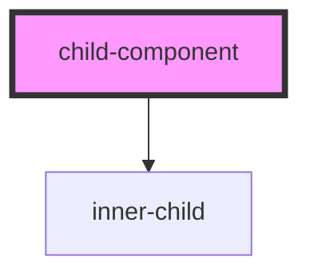

# child-component

<!-- Auto Generated Below -->

## Properties

| Property | Attribute | Description | Type     | Default     |
| -------- | --------- | ----------- | -------- | ----------- |
| `count`  | `count`   |             | `number` | `undefined` |

## Dependencies

### Depends on

- [inner-child](../inner-child)

### Graph

----------------------------------------------

*Built with [StencilJS](https://stenciljs.com/)*
